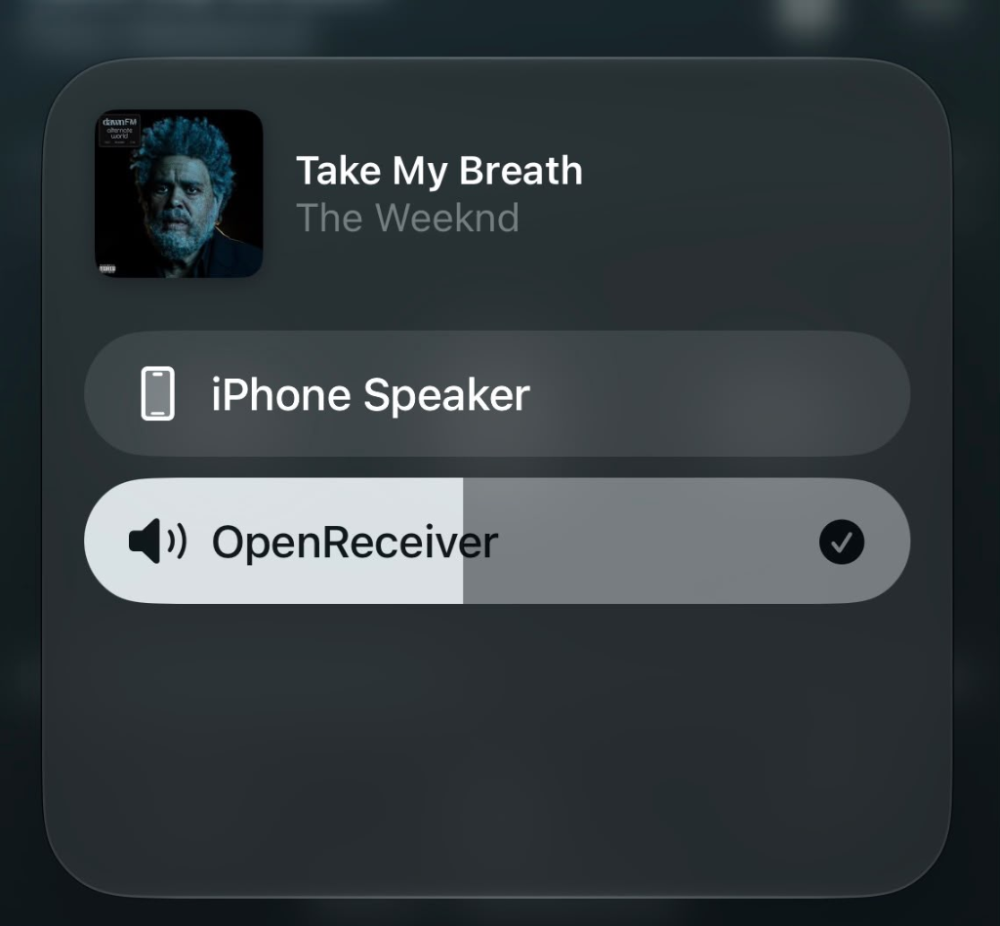
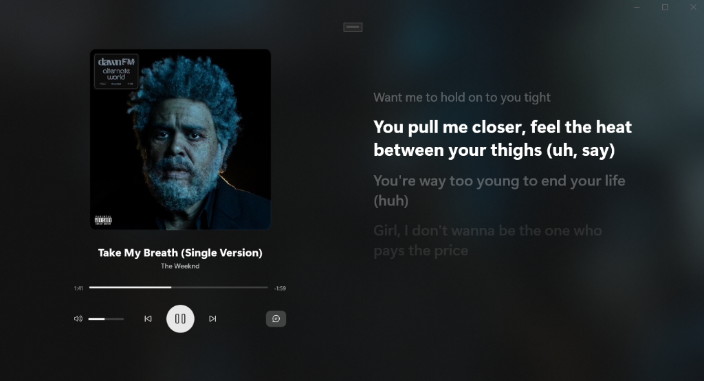

  
  <h1>OpenReceiver</h1>
  
<b>A Clean-Room, High-Fidelity AirPlay Audio Receiver for Windows & Android TV</b>

  
  
  
  

 

OpenReceiver is a modern, cross-platform AirPlay audio receiver implemented entirely from scratch in **C++17**. Designed under strict "clean-room" principles to ensure zero GPLv3 contamination, it is safe for proprietary commercial integration. 

Unlike legacy AirPlay mirroring forks, OpenReceiver focuses exclusively on providing an uncompromising, high-fidelity audio pipeline paired with a cinematic user interface that feels native to modern living room displays.

<i>The OpenReceiver Windows 11 Shell displaying the Cinematic UI and Synchronized Lyrics.</i>

<i>Seamless native integration with the iOS Control Center.</i>

---

## Core Architecture

The repository is strictly segregated to ensure absolute separation between the protocol parsing layer and the platform-specific UI shells.

- **`core/` (C++17 Engine)**
  - Implements the complete AirPlay 1 (RAOP) state machine.
  - Handles Zero-Configuration Networking (mDNS) discovery.
  - Safely parses and negotiates RTSP handshakes (Options, Setup, Record, Teardown).
  - Handles real-time ALAC (Apple Lossless Audio Codec) decoding.
  - Provides the `LyricsSynchronizer` and `ILyricsProvider` interfaces.

- **`windows/` (WinUI 3 Shell)**
  - Native Windows 11 integration using C# and WinUI 3.
  - C++ `core` integration via a P/Invoke Native Bridge.
  - Hardware-accelerated composition for blurred backgrounds and smooth animations.

- **`android/` (Android TV Shell)**
  - Optimized Kotlin Leanback UI for 10-foot viewing experiences.
  - Asynchronous background service lifecycle.
  - JNI bindings directly to the C++ core (`NativeBridge.kt`).

---

## Features

### Cinematic "Now Playing" Experience
OpenReceiver doesn't just play audio; it visualizes it. The UI extracts album artwork directly from the protocol and renders a gorgeous, full-screen layout utilizing the native Windows 11 Acrylic Backdrop to blend with your desktop environment. The layout is fully responsive, smoothly centering the album art when the lyrics panel is closed.

### Real-Time Synchronized Lyrics
The integrated **Lyrics Engine** intercepts incoming track metadata and asynchronously fetches lyrics.
- **Primary Source**: Uses the [LRCLIB API](https://lrclib.net/) to fetch cryptographically matched time-synced lyrics.
- **Fallback Source**: Falls back to local `.lrc` files on disk.
- **Engine**: Parses timecodes using optimized RegEx and synchronizes the active lyric in O(log n) time using binary search algorithms tied exactly to the RTP audio timestamp.

### Two-Way DACP Integration
Full implementation of the Digital Audio Control Protocol (DACP) allows bidirectional control.
- **Playback Controls**: Play, Pause, Next, and Previous Track commands are sent back to the source device seamlessly.
- **Volume Synchronization**: Physical volume buttons on the iPhone perfectly scale the custom volume bar on the desktop app.
- **Accurate Timeline**: The progress bar parses absolute RTP timestamps to accurately reflect playback progress, respecting iOS AirPlay limitations regarding network scrubbing.

---

## Building & Integration

Because OpenReceiver strictly segregates its logic from its UI, building requires the specific toolchain for your target platform.

| Target Platform | Toolchain Requirement | Instructions |
| :--- | :--- | :--- |
| **C++ Core Engine** | CMake 3.10+ | [View Core Build Guide](docs/BUILDING.md#1-building-the-core-cross-platform) |
| **Windows 11 App** | Visual Studio 2022 (WinUI 3) | [View Windows Build Guide](docs/BUILDING.md#2-building-for-windows-winui-3) |
| **Android TV App** | Android Studio (NDK) | [View Android Build Guide](docs/BUILDING.md#4-building-for-android-tv) |

### Automated Packaging
For Windows deployments, OpenReceiver includes a standalone **Inno Setup** script (`windows/packaging/OpenReceiver.iss`). Compiling this script generates a professional `.exe` installer that automatically registers the required Windows Defender Firewall exceptions for UDP/TCP AirPlay traffic.

---

## Network & Discovery

AirPlay relies heavily on multicast DNS (mDNS). OpenReceiver provides an automated Python script (`scripts/advertise_mdns.py`) for advertising the service on the local network. 

If your network is failing to discover the receiver, it is typically related to router-level AP Isolation or OS-level firewall restrictions. 
Read the [Troubleshooting & Network Configuration Guide](docs/TROUBLESHOOTING.md) for step-by-step resolution paths.

---

  
Built with precision for <b>OpenPlay</b>.

